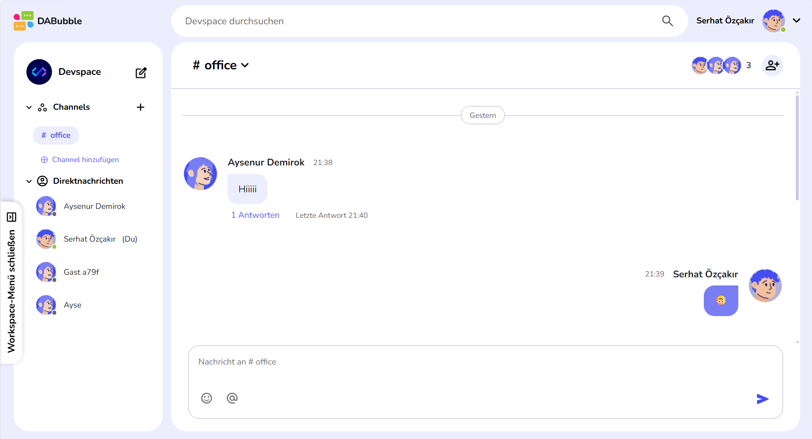
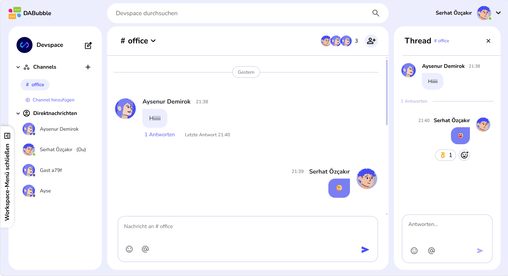
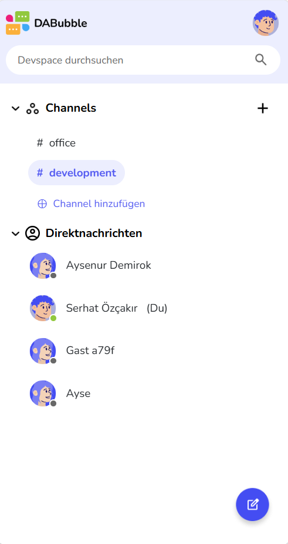
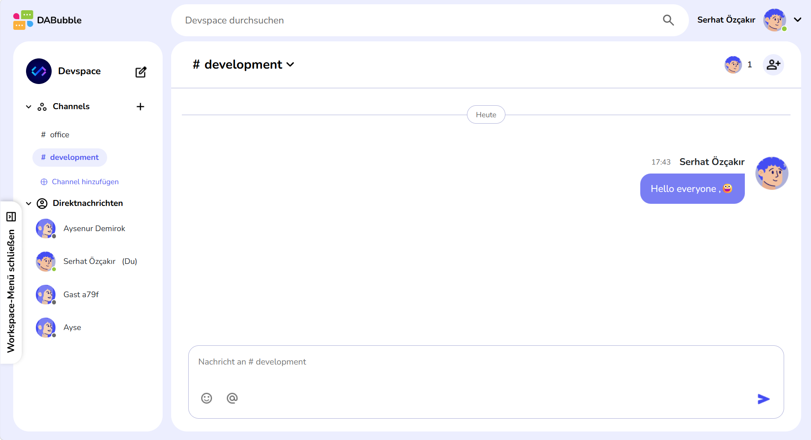

# 💬 DA-Bubble

<p align="center">
  
</p>

<h3 align="center">
A full-featured real-time team communication platform built with Angular 20 and Supabase.
</h3>

<p align="center">
  Inspired by modern collaboration platforms such as Slack and Discord.
</p>

<p align="center">
  
  
  
  
  
</p>

<p align="center">
  <a href="https://serhat-oezcakir.de/DA-Bubble/">🚀 Live Demo</a>
  •
  <a href="https://serhat-oezcakir.de">🌐 Portfolio</a>
</p>

---

## 📖 About the Project

**DA-Bubble** is a responsive real-time communication platform for teams and communities.

Users can communicate through public channels, direct messages and threaded conversations while messages, reactions, channel memberships and user information are synchronized across connected clients in real time.

The application was developed with **Angular 20**, **TypeScript** and **Supabase**, with a strong focus on maintainable frontend architecture, responsive UX, secure database access and real-time communication.

The project includes a complete authentication flow, channel management, direct messaging, threaded discussions, reactions, search, mentions and guest access.

---

## ✨ Key Features

### 🔐 Authentication

- Email & password authentication
- Google OAuth login
- Anonymous guest login
- Password reset flow
- Persistent authentication sessions
- Protected workspace routes

### 💬 Messaging

- Public channel conversations
- Private direct messages
- Threaded discussions
- Message editing
- Real-time message synchronization
- Real-time thread updates
- Last reply information

### 😀 Reactions & Mentions

- Emoji picker
- Emoji reactions
- Reaction toggling
- Reaction summaries
- Recently used reactions
- `@User` mentions
- `#Channel` mentions

### 👥 Channels & Users

- Create channels
- Edit channel name and description
- Add members to channels
- Leave channels
- Real-time channel membership updates
- User profiles and avatars
- Online / offline status
- Guest profiles with automatically generated identities

### 🔍 Search

- Search users
- Search channels
- Search messages
- Direct-message search
- `@` and `#` based search modes

### 📱 Responsive UX

- Fully responsive desktop and mobile layouts
- Dedicated mobile navigation
- Mobile channel management
- Mobile thread view
- Mobile search
- Optimized virtual-keyboard behavior
- Support for small smartphone displays

---

## 🏗️ Architecture & Engineering

DA-Bubble was developed with a strong focus on maintainability, separation of concerns and production-oriented frontend architecture.

### 🧩 Feature-Based Architecture

The application is organized into clearly separated feature areas such as authentication, workspace, messaging, channels, threads and user management.

Business logic and Supabase communication are primarily handled through dedicated services, keeping UI components focused on presentation and user interaction.

### ⚡ Angular Signals

Angular Signals are used extensively for reactive application and UI state, including:

- Messages and direct messages
- Selected conversations and threads
- Reaction summaries
- Search state
- Dialog and mobile navigation state
- Current user and channel state

Signals are also integrated with incoming real-time database events to keep the interface synchronized with backend changes.

### 🛡️ Route Guards

Protected application areas are secured using Angular Route Guards.

The workspace cannot be accessed without a valid authenticated session, while public authentication and legal routes remain independently accessible.

### 📦 Lazy Loading & Code Splitting

Major application areas are lazy-loaded through Angular Router.

Authentication and workspace routes are loaded only when required, while standalone pages use `loadComponent()` where appropriate.

This reduces unnecessary code in the initial application bundle and separates major application areas into independently loaded chunks.

### 🔄 Real-Time Architecture

Supabase Realtime is used to synchronize application state across multiple connected clients without requiring page refreshes.

Dedicated real-time listeners handle:

- New channel messages
- Message updates
- Direct messages
- Thread replies
- Emoji reactions
- Channel changes
- Channel membership changes
- User profile changes

Incoming database events are integrated into the application's Angular state so that the UI responds immediately to backend changes.

### 🔐 Authentication Architecture

Authentication logic is centralized in dedicated services and supports:

- Email / password authentication
- Google OAuth
- Anonymous guest sessions
- Password reset
- Session restoration
- Protected routes
- User presence handling

### 🗄️ Database Security

Supabase Row Level Security (**RLS**) policies are used to control access to application data.

Authorization rules protect resources such as:

- Profiles
- Channels
- Channel memberships
- Messages
- Direct messages
- Reactions

This ensures that access control is enforced at the database level rather than relying only on frontend restrictions.

---

## 🚀 Performance & Optimization

The project went through a dedicated performance and optimization phase after the core functionality was completed.

### 🌐 Network & Database Optimization

- Reduced unnecessary Supabase query responses
- Selected only required database fields where appropriate
- Removed unnecessary `.select()` calls from write operations
- Reduced redundant database communication where safely possible
- Optimized message-to-thread mapping using grouped lookup structures

### ⚡ Angular Optimization

- Lazy-loaded major application areas
- Used standalone components
- Used Angular Signals for reactive state management
- Separated database and application logic into dedicated services
- Avoided unnecessary component-level data fetching
- Used route-level code splitting

### 🔄 Real-Time Optimization

- Dedicated subscriptions for different real-time responsibilities
- Duplicate real-time thread messages are prevented before state updates
- Local application state is updated from incoming events where appropriate
- Real-time subscriptions are cleaned up when no longer required

### 📱 Responsive Optimization

The application was tested and optimized across desktop and mobile layouts.

Special attention was given to:

- Small smartphone displays
- Dynamic mobile viewport behavior
- Virtual keyboard resizing
- Mobile navigation
- Thread layouts
- Popovers and emoji pickers
- Responsive message layouts

---

## 🧹 Code Quality

After feature development, the codebase went through a dedicated clean-code and refactoring phase.

The refactoring focused on:

- Single-responsibility methods
- Small and readable functions
- Clear service / component separation
- Reusable private helper methods
- Consistent naming conventions
- Reduced code duplication
- Removal of unused code
- Removal of development/debug logging
- Behavior-preserving refactoring
- Clear comments for non-obvious business and architectural logic

The goal was not only to make the application functional, but also to keep the codebase understandable, maintainable and easier to extend.

---

## 🛠️ Tech Stack

### Frontend

- Angular 20
- TypeScript
- Angular Signals
- Standalone Components
- Angular Router
- Route Guards
- Lazy Loading
- Reactive Forms
- RxJS
- SCSS

### Backend & Database

- Supabase
- PostgreSQL
- Supabase Authentication
- Supabase Realtime
- Row Level Security (RLS)

### Authentication

- Email / Password
- Google OAuth
- Anonymous Guest Authentication

### Development Tools

- Git
- GitHub
- Figma
- Visual Studio Code
- Angular CLI

---

## 📸 Screenshots

### 💬 Workspace

<p align="center">
  
</p>

### 🧵 Threads & Reactions

<p align="center">
  
</p>

### 📱 Mobile Experience

<p align="center">
  
</p>

### 👥 Channel Management

<p align="center">
  
</p>

---

## 🚀 Running the Project Locally

Clone the repository:

```bash
git clone https://github.com/serhat-ozcakir/DA-Bubble.git
```

Install dependencies:

```bash
npm install
```

Start the development server:

```bash
ng serve
```

Then open:

```text
http://localhost:4200
```

> Backend functionality requires a configured Supabase project and the corresponding environment configuration.

---

## 🌐 Production

DA-Bubble is deployed as a production Angular build and connected to a hosted Supabase backend.

**Live Application:**  
https://serhat-oezcakir.de/DA-Bubble/

---

## 🗺️ Possible Future Improvements

Possible extensions for the platform include:

- File sharing
- Voice messages
- Voice / video calls
- Push notifications
- Read receipts
- Dark mode
- Workspace administration
- AI-assisted communication features

---

## 👨‍💻 Author

### Serhat Özçakır

Frontend Developer

🌐 **Portfolio**  
https://serhat-oezcakir.de

💼 **LinkedIn**  
https://www.linkedin.com/in/serhat-%C3%B6z%C3%A7ak%C4%B1r/

💻 **GitHub**  
https://github.com/serhat-ozcakir

---

## ⭐ Support

If you like the project, feel free to give the repository a **Star ⭐**.

Feedback and suggestions are always welcome.
